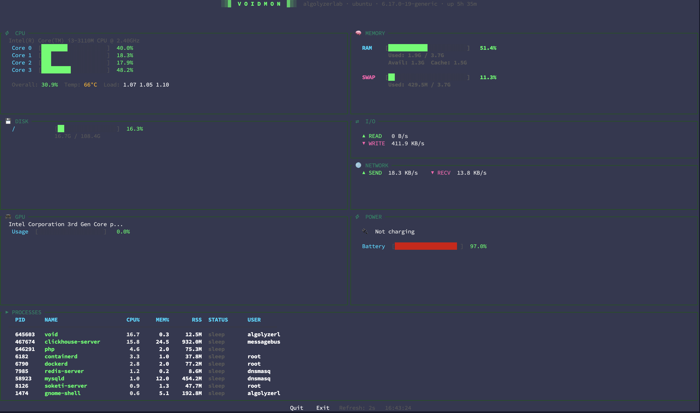
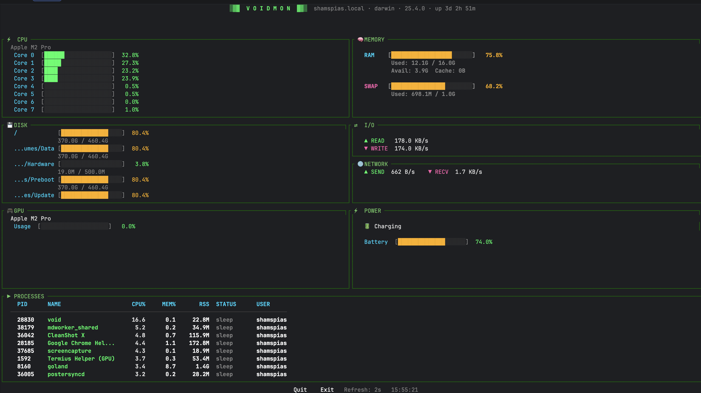

<div align="center">

```
░▒▓█  V O I D M O N  █▓▒░
```

**A sleek, hacker-aesthetic terminal system monitor written in Go.**

Fast. Minimal. Beautiful.

[](https://go.dev)
[](LICENSE)
[]()

</div>

---

## Screenshots

<!-- Add your screenshots here -->
<div align="center">

| Linux                                      | macOS                                      |
|--------------------------------------------|--------------------------------------------|
|  |  |

</div>

---

## Features

- **CPU** — Per-core usage bars, temperature, load averages
- **Memory** — RAM & SWAP usage with detailed breakdown
- **Disk** — All mounted filesystems with usage bars
- **I/O** — Real-time disk read/write speeds and IOPS
- **Network** — Send/receive throughput
- **GPU** — Full cross-platform support:
    - NVIDIA (via `nvidia-smi`)
    - AMD (via sysfs / ROCm)
    - Intel Integrated (via sysfs / i915)
    - Apple Silicon M1/M2/M3/M4 (via `system_profiler` + `powermetrics`)
    - Intel Mac with discrete GPU (via `ioreg`)
- **Power** — Battery status, AC detection, power draw (Linux sysfs + macOS `pmset`)
- **Processes** — Top 15 by CPU usage with color-coded status

---

## Install

### One-liner (Linux & macOS)

```bash
curl -fsSL https://raw.githubusercontent.com/shamspias/voidmon/main/install.sh | bash
```

### Go Install (requires Go 1.25.5+)

```bash
go install github.com/shamspias/voidmon@latest
```

> The binary installs as `voidmon`. To use the `void` command, create an alias:
> ```bash
> echo 'alias void="voidmon"' >> ~/.bashrc  # or ~/.zshrc
> source ~/.bashrc
> ```

### Homebrew (macOS & Linux)

```bash
# Coming soon — for now use one of the methods above
brew tap shamspias/tap
brew install voidmon
```

### From Source

```bash
git clone https://github.com/shamspias/voidmon.git
cd voidmon
make build
make install    # installs `void` to /usr/local/bin
```

### From GitHub Releases

Download the latest binary for your platform from
[**Releases**](https://github.com/shamspias/voidmon/releases):

| Platform            | Binary              |
|---------------------|---------------------|
| Linux x86_64        | `void-linux-amd64`  |
| Linux ARM64         | `void-linux-arm64`  |
| macOS Apple Silicon | `void-darwin-arm64` |
| macOS Intel         | `void-darwin-amd64` |

```bash
# Example: Linux x86_64
wget https://github.com/shamspias/voidmon/releases/latest/download/void-linux-amd64.tar.gz
tar -xzf void-linux-amd64.tar.gz
sudo mv void-linux-amd64 /usr/local/bin/void
```

---

## Usage

```bash
# Just type:
void

# Custom refresh rate:
void -r 1s       # 1 second
void -r 500ms    # half second
void -r 5s       # 5 seconds

# Version info:
void -v
```

## Keybindings

| Key   | Action |
|-------|--------|
| `q`   | Quit   |
| `Esc` | Exit   |

---

## macOS Notes

### Apple Silicon GPU Metrics

For full GPU utilization and power metrics on Apple Silicon (M1/M2/M3/M4), `voidmon` uses `powermetrics` which requires
sudo access. To enable without password prompts:

```bash
# Option 1: Run voidmon with sudo
sudo void

# Option 2: Allow passwordless powermetrics (add to /etc/sudoers)
sudo visudo
# Add this line:
# yourusername ALL=(ALL) NOPASSWD: /usr/bin/powermetrics
```

Without sudo, voidmon will still show GPU name and VRAM from `system_profiler`, just without live utilization data.

### CPU Temperature on macOS

Install `osx-cpu-temp` for CPU temperature readings:

```bash
brew install osx-cpu-temp
```
---

## Building Releases

```bash
# Build for all platforms
make build-all

# Create release tarballs
make release
```

---

## Contributing

1. Fork it
2. Create your branch (`git checkout -b feat/thing`)
3. Commit (`git commit -am 'add thing'`)
4. Push (`git push origin feat/thing`)
5. Open a PR

---

## License

MIT — do whatever you want.